#  WooCommerce Product Markup Plugin

  

---

<p align="center">
  
</p>

<h2 align="center">✨ Add Markup to All Your WooCommerce Products! ✨</h2>

---

## Features

- 💸 **Add Fixed or Percentage Markup** to all WooCommerce products
- ⚡ **Instantly applies** markup to all products (no manual editing!)
- 🛒 **Works with variable products**
- 🧮 **Dynamic calculation** – original prices are preserved
- 🛡️ **Easy to enable/disable** from the admin panel
- 🖥️ **Simple settings page** in WooCommerce menu

---

## 🛠️ Installation

1. 📦 Download or clone this repository
2. 🗂️ Upload `markup-increase.php` to your `/wp-content/plugins/` directory
3. 🔄 Activate the plugin via the WordPress Plugins menu

---

## ⚙️ Usage

1. Go to **WooCommerce → Product Markup** in your WordPress admin
2. ✅ Enable markup
3. Choose **Percentage (%)** or **Fixed Amount**
4. Enter your desired markup value (e.g., `10` for 10% or `5.00` for $5.00)
5. 💥 All product prices are updated instantly!

---

## 🖼️ Demo

```mermaid
%% Simple animation using Mermaid
sequenceDiagram
    participant Admin as 👩‍💻 Admin
    participant Plugin as 🔌 Markup Plugin
    participant Store as 🛍️ Storefront
    Admin->>Plugin: Enable markup (10%)
    Plugin->>Store: Update all product prices
    Store->>Customer: Shows new prices
```



---

## 📢 Support & Feedback

- 📝 [Open an issue](https://github.com/your-repo/issues) for bugs or feature requests
- 🌐 [Plugin Homepage](https://rakmyat.com/)

---

## 📄 License

This plugin is licensed under the [GNU General Public License v2.0 or later](https://www.gnu.org/licenses/gpl-2.0.html).

```
Copyright (c) Yousef Abdallah

This program is free software: you can redistribute it and/or modify
it under the terms of the GNU General Public License as published by
 the Free Software Foundation, either version 2 of the License, or
 (at your option) any later version.

This program is distributed in the hope that it will be useful,
but WITHOUT ANY WARRANTY; without even the implied warranty of
MERCHANTABILITY or FITNESS FOR A PARTICULAR PURPOSE.  See the
GNU General Public License for more details.
```

---

<p align="center">
  
  <br/>
  <b>Happy Selling!</b>
</p> 